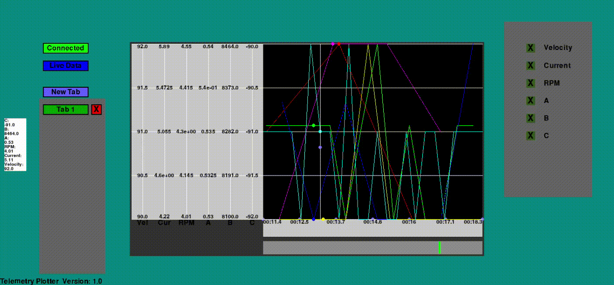

# Telemetry's Infograph plotter

The infograph plotter allows visualization data collected by Ecocar-Unicamp's telemetry system. It shows realtime serial comunication information in the form of graphs, and automates the entire connecting process. The plotter also allows the selection of displayed data, and offers specific tools for a more indepth analysis of data points. While running, the program saves all collected data in a .txt file.

* Latest version: V.1.0

## Instalation

1. Dowload the latest versions of TelEco.py to your computer and TelEco Arduino.ino to your arduino;
2. Add the periferic files to the ssame folder as the program;
3. You may use pyinstaller to generate an executable for the program.

## Setup <!-- trocar essa parte quando estabelecer protocolo can -->

Connect an arduino to your computer. Then, run the python code.
You can add custom tabs by changing the contents of the "predefined tabs.txt" file (will be explained later).

## Usage

### Connecting

To connect with the telemetry sistem, click the "connect" button. It should indicate the start of the connecting process (if it doesn't, make sure that the arduino has the right code, and connection with the computer is well stablished).

 <!-- trocar imagem -->

When a connection is stablished the button text will change to "connected".

 <!-- trocar imagem -->

### Navigating the graph

The following methods allows the user to change the manner in wich the graps are presented:
* Zoom in and zoom out: using the mouse wheel
* Graph displacement:  LEFT and RIGHT arrow keys (unitary displacement) or UP and DOWN arrow keys (quick displacement). You can also use the mouse to click on the bar and change the visulization window more quickly. By pressing "Set Window", the graph will fulfill the window.
* Freeze or de-freeze the graph: by clicking the "Freeze" button. The graph will also freeze should you displace it. 
* Change the graph's proportion: by pressing the "Local View/ Global View" button.

#### Comparing Information
The information box contains the last value of each graph. Placing the mouse cursor in the graph area highlights the closest points' values with dots, and present their respective values and reference time on the information box. In this situation, you can press MOUSE1 to fixate this position in the "probe" column. Pressing MOUSE2 releases the saved positon.

The values will appear red when a certain value is out of the expected.

 <!-- trocar imagem -->

### Selecting infographs

The user can select what information to display clicking on the checkboxes on the right side of the window. This selection will be saved in the current tab, and new tabs can be opend with the "New Tab" button. To change the tab shown, just click on the new desired tab; to close it, click on the "x" (at least 1 tab should be opened). 

 <!-- trocar imagem -->

#### Predefinig Tabs

You can add custom tabs by changing the contents of the "predefined tabs.txt" file, with the following rules: <!-- imagem -->

* Each line represents a tab;
* Information for each tab should be divided by semicolons (";");
* The first element for each line should be the tab's name;
* The following elements should be numbers and, in order, represent the tab's state of each checkbox (0 is the deselected state, and 1 is the selected. Selected is the standard state). 
* If the tab's configuration contains more checkboxes than allowed, it will discard the extra information.

## Code info

The plotter is written in python using the [pygame library](https://www.pygame.org/news) wich makes the graphic interface and user input easy to implement.
The [pyserial library](https://pyserial.readthedocs.io/en/latest/pyserial.html) is also used for the comunication with the telemetry system.
