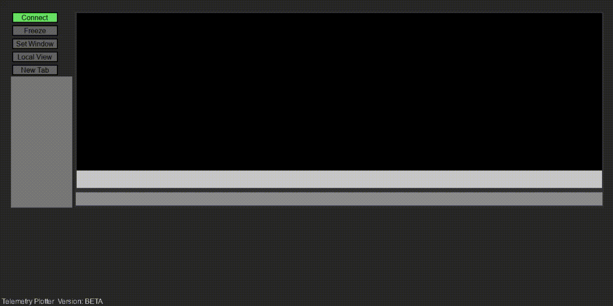
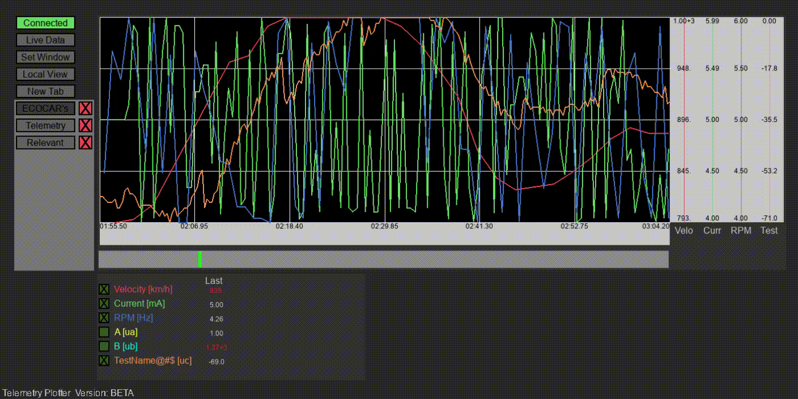
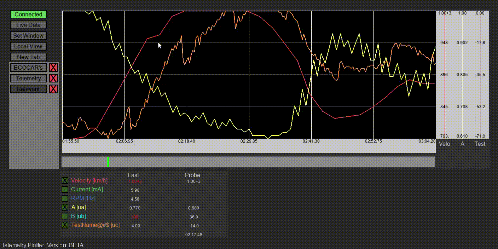

# Gerador de Gráficos da Telemetria

O gerador de gráficos permite a visualização dos dados coletados pelo sistema de telemetria da Ecocar-Unicamp. Ele mostra informações de comunicação serial em tempo real na forma de gráficos e automatiza todo o processo de conexão. O programa também permite a seleção dos dados exibidos e oferece ferramentas específicas para uma análise mais aprofundada dos dados. Durante a execução, o programa salva todos os dados coletados em um arquivo .txt.

* Versão mais recente: V.1.0

## Instalação

1. Baixe as versões mais recentes do TelEco.py para o seu computador e do TelEco Arduino.ino para o seu arduino;
2. Adicione os arquivos periféricos à mesma do programa;
3. Você pode usar o pyinstaller para gerar um executável para o programa.

## Setup

Conecte um arduino ao seu computador. Em seguida, execute o código Python ou o programa gerado pelo pyinstaller.
Você pode adicionar guias personalizadas alterando o conteúdo do arquivo "predefined tabs.txt" (será explicado posteriormente).

## Uso

### Conectando

Para se conectar ao sistema de telemetria, clique no botão "conectar". Deve indicar o início do processo de conexão (caso contrário, certifique-se de que o arduino tenha o código correto e a conexão com o computador esteja bem estabelecida).

Quando uma conexão for estabelecida, o texto do botão mudará para "conectado".

### Navegando no gráfico

Os métodos a seguir permitem ao usuário alterar a forma como os gráficos são apresentados:
* Aumentar e diminuir o zoom: usando a roda do mouse
* Deslocamento do gráfico: teclas de seta ESQUERDA e DIREITA (deslocamento unitário) ou teclas de seta PARA CIMA e PARA BAIXO (deslocamento rápido). Você também pode usar o mouse para clicar na barra e alterar a janela de visualização mais rapidamente. Ao pressionar "Definir janela", o gráfico preencherá a janela.
* Congele ou descongele o gráfico: clicando no botão "Congelar". O gráfico também congelará caso você o desloque.
* Altere a proporção do gráfico: pressionando o botão "Visualização local / Visualização global".

#### Comparando informações
A caixa de informações contém o último valor de cada gráfico. Posicionar o cursor do mouse na área do gráfico destaca os valores dos pontos mais próximos com pontos, e apresenta seus respectivos valores e tempo de referência na caixa de informações. Nesta situação, você pode pressionar MOUSE1 para fixar esta posição na coluna "sonda" e pressioná-lo novamente para liberar a posição.

Os valores aparecerão em vermelho quando um determinado valor estiver fora do esperado.

### Selecionando infografias

O usuário pode selecionar quais informações exibir clicando nas caixas de seleção no lado direito da janela. Esta seleção será salva na aba atual, e novas abas podem ser abertas com o botão "Nova Aba". Para alterar a aba mostrada, basta clicar na nova aba desejada; para fechá-la, clique no "x" (pelo menos 1 guia deve estar aberta).

#### Abas Predefinig

Você pode adicionar guias personalizadas alterando o conteúdo do arquivo "tabs.txt predefinido", com as seguintes regras: 

* Cada linha representa uma guia;
* As informações de cada guia devem ser divididas por ponto e vírgula (";");
* O primeiro elemento de cada linha deve ser o nome da guia;
* Os elementos a seguir devem ser números e, em ordem, representam o estado da guia de cada caixa de seleção (0 é o estado desmarcado e 1 é o selecionado. Selecionado é o estado padrão).
* Se a configuração da guia contiver mais caixas de seleção do que o permitido, ela descartará as informações extras.

## Informações salvas

Todos os dados serão salvos em um arquivo .txt, formatado para serem exibidos em uma planilha, em uma pasta com a data de salvamento.

## Informação do código

O plotter é escrito em python usando a [biblioteca pygame] (https://www.pygame.org/news) que torna a interface gráfica e a entrada do usuário fáceis de implementar.
A [biblioteca pyserial] (https://pyserial.readthedocs.io/en/latest/pyserial.html) também é usada para a comunicação com o sistema de telemetria.
